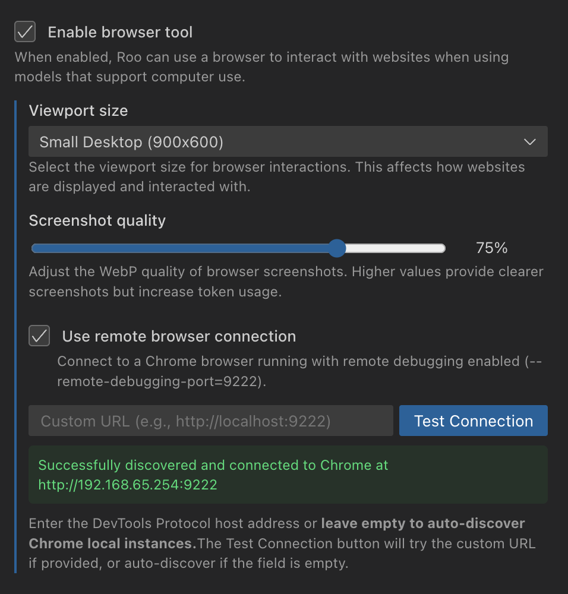

# Remote Browser Connection

## What Is Remote Browser Connection?

Connect Roo to an existing Chrome browser instead of launching a new one. This powerful feature bypasses Roo's default browser process creation, enabling you to use Roo in containerized environments, with custom browser profiles, and across remote development workflows.

> **Key Benefit:** Remote browser connection solves common challenges with containerized development and remote workflows by separating the browser process from the VS Code environment.

### When To Use Remote Browser Connection

- **DevContainers:** Connect from containerized VS Code to a Chrome browser running on your host system
- **Remote Development:** Use Chrome on a local development machine while working on a remote server
- **Custom Chrome Profiles:** Leverage specific profiles with your preferred extensions and settings
- **Shared Browser Sessions:** Allow multiple Roo instances to connect to the same browser session

## Setting Up Remote Browser Connection

To use the remote browser connection feature, you'll need to complete three simple steps: launch Chrome with remote debugging enabled, configure Roo settings, and (if using containers) set up network access.

### 1. Launch Chrome with Remote Debugging

Launch Chrome with the remote debugging port enabled:

**On macOS:**
```bash
/Applications/Google\ Chrome.app/Contents/MacOS/Google\ Chrome --remote-debugging-port=9222 --user-data-dir=/tmp/chrome-debug
```

**On Windows:**
```bash
"C:\Program Files\Google\Chrome\Application\chrome.exe" --remote-debugging-port=9222 --user-data-dir=C:\chrome-debug
```

**On Linux:**
```bash
google-chrome --remote-debugging-port=9222 --user-data-dir=/tmp/chrome-debug
```

> **Note:** The `--user-data-dir` parameter creates a separate Chrome profile that won't interfere with your regular browsing.

### 2. Configuring Roo Settings

Once Chrome is running with remote debugging, configure Roo:

1. Open VS Code settings and search for "Roo browser"
2. Enable "Use remote browser connection"
3. Optionally enter a custom Chrome DevTools Protocol URL (for non-standard setups)
4. Click "Test Connection" to verify connectivity




### 3. Setting Up DevContainer Integration

If you're developing inside a container, you'll need to configure network access to reach the host machine:

For VS Code devcontainers, add this network configuration to your `devcontainer.json`:

```json
"runArgs": [
    "--network=host"  // Enables access to host's Chrome instance
]
```

## Understanding How Connections Work

After configuration, Roo establishes connections with Chrome using a sophisticated multi-step process to ensure reliability.

When enabled, Roo connects to Chrome following this sequence:

1. Attempts connection using your custom URL (if provided)
2. If unsuccessful, runs auto-discovery on localhost, Docker containers, and local network
3. Falls back to launching a local browser instance if all remote connection attempts fail

## Troubleshooting Connection Problems

If you encounter issues with the remote browser connection, here are solutions to the most common problems:

- **Connection Failed:** Verify Chrome is running with the correct debugging flag and port
- **Port Already in Use:** Change to an alternative port (e.g., `9333`) in both your Chrome launch command and Roo settings
- **Network Issues:** Ensure your container/VM network settings allow access to the Chrome host machine
- **Chrome Not Detected:** Check that firewall settings aren't blocking WebSocket connections
- **Permission Errors:** Make sure you have the necessary permissions to access the specified `--user-data-dir` location

## Exploring Advanced Capabilities

For power users and advanced scenarios, Roo's remote browser connection includes several sophisticated features that enhance flexibility and reliability.

### How Auto-Discovery Works

When no specific URL is provided, Roo automatically locates Chrome instances by searching:
- Standard debugging ports on localhost (9222, 9223)
- Running containers with debugging-enabled Chrome
- Network-accessible instances using discovery protocols

### Understanding Automatic Fallback

When remote connection attempts fail, Roo automatically launches a local browser instance, ensuring continuous workflow without manual intervention.

### Alternative Setup: Using Chrome DevTools

For situations where command-line configuration isn't ideal:

1. Open `chrome://inspect` in Chrome
2. Click "Configure" next to "Discover network targets"
3. Add `localhost:9222` and click "Done"

## Related Features

Remote browser connection works seamlessly with other Roo features:

- **[Custom Modes](custom-modes)**: Create specialized browser-based modes
- **[Code Actions](code-actions)**: Execute browser-based actions against remote instances
- **[Large Projects](large-projects)**: Improve performance by separating browser processes

## Summary

Remote browser connection provides flexibility for containerized development, custom browser profiles, and remote workflows. By following the setup instructions in this guide, you can leverage the power of an existing Chrome instance for your Roo sessions, making your development process more efficient and adaptable to various environments.